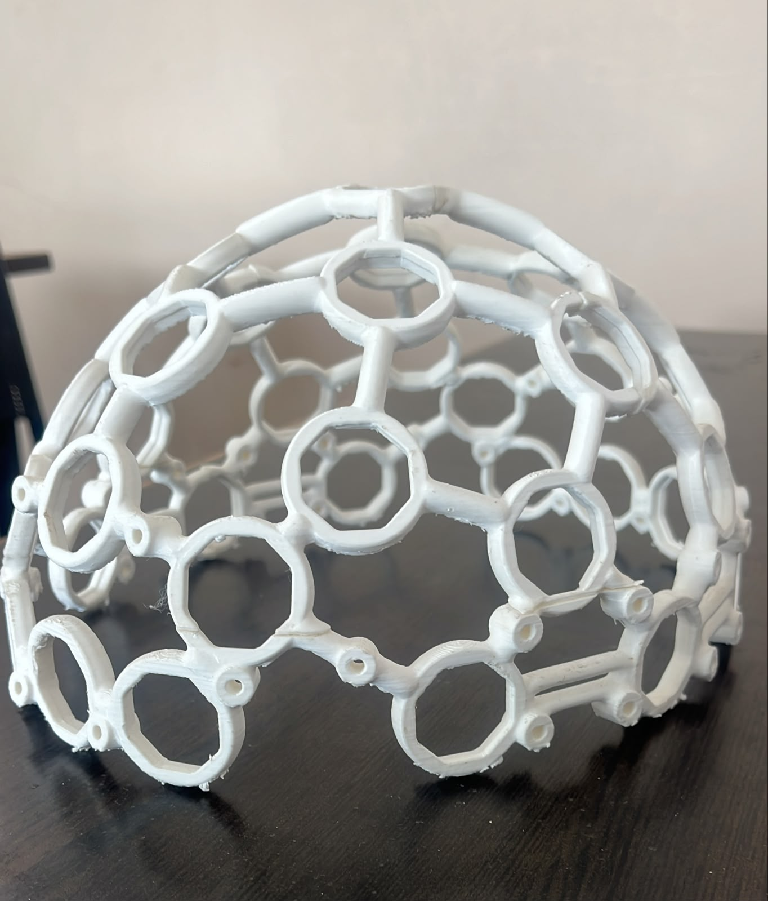
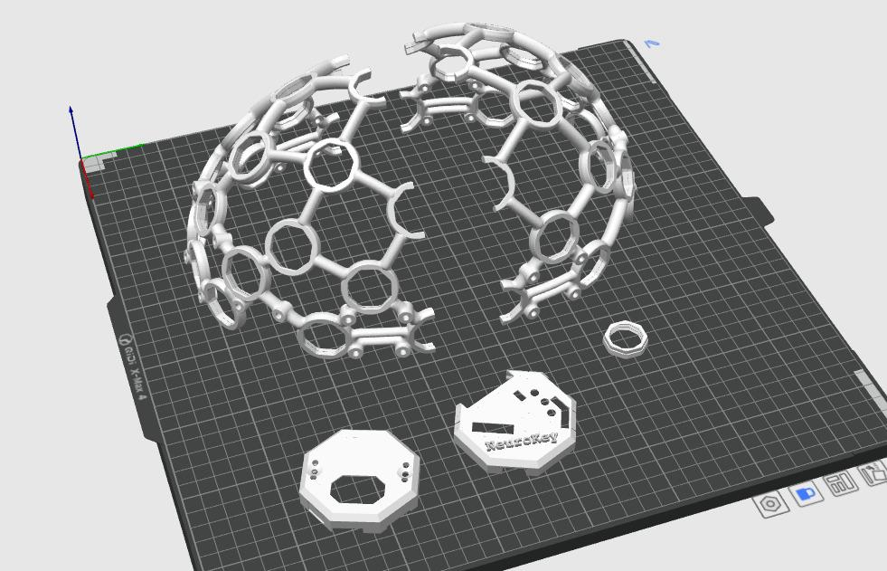
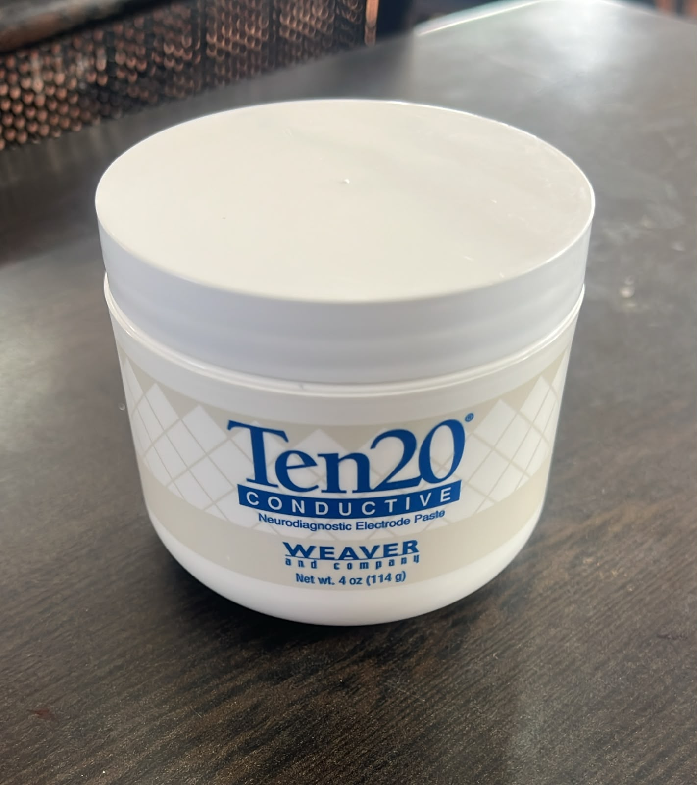
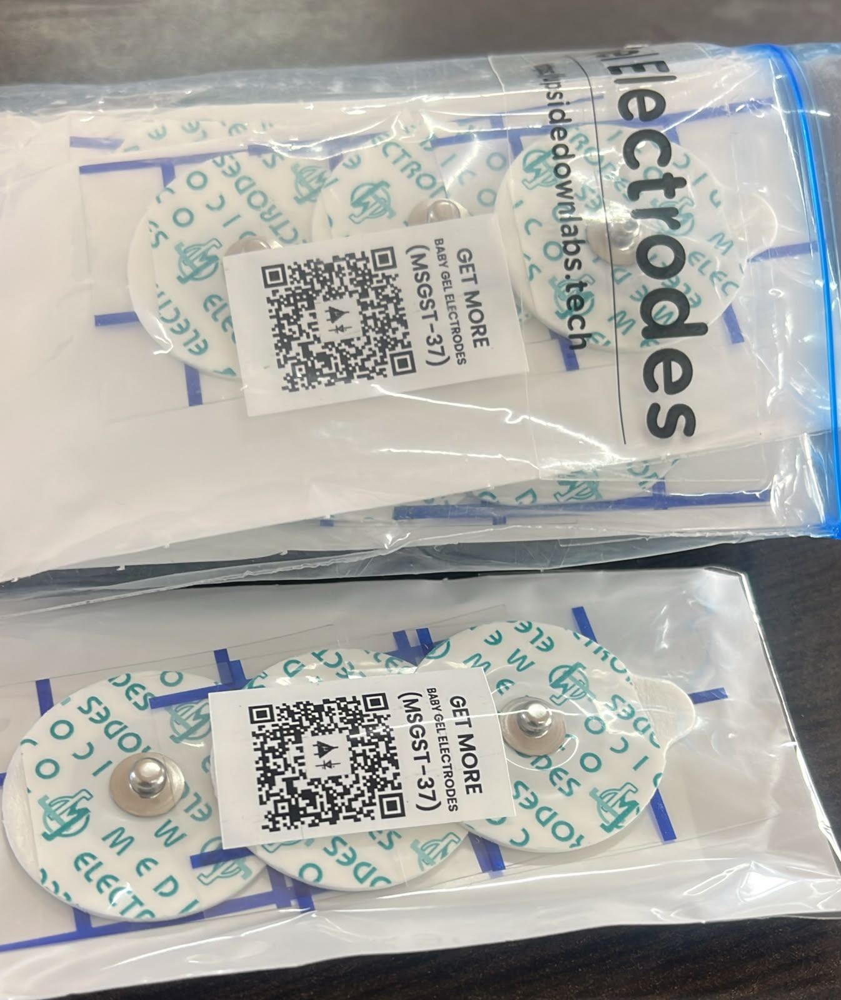

# NeuroKey

NeuroKey is our final-year engineering project exploring a low-cost assistive control system for people who have difficulty using conventional switches, remotes, or joysticks.

The system is being designed to read a voluntary eye, blink, jaw, or facial-muscle signal through an NPG Lite Beast Pack. A reliable detected action can then be used to navigate a simple menu and operate a low-voltage home-control demonstration, request caregiver assistance, or control a small mobility prototype.

## Current status

This project is under active development. The initial research, architecture, hardware selection, 3D printing, and first EMG threshold experiments have been completed. Repeated signal testing and threshold tuning are continuing before the detector is connected to any output device.

## Prototype photographs

| Physical headset prototype | Print preparation |
|---|---|
|  |  |

The white headset is a locally printed prototyping frame adapted from an OpenBCI 3D-printable headset design. It gives the team a physical platform for studying electrode locations, fit, cable routing, and enclosure ideas. We do not claim the underlying headset geometry as our original design. The NeuroKey-labelled part shown in the slicer is a team-added prototype component. The exact upstream model and licence will be linked here after the original model page is confirmed.

| Conductive paste | Disposable gel electrodes |
|---|---|
|  |  |

### Completed

- Defined the problem and intended user group
- Selected the NPG Lite Beast Pack for biosignal acquisition
- Purchased gold electrodes and Ten20 conductive paste
- Developed the initial system architecture and implementation plan
- Created and 3D printed an early headset design
- Completed initial jaw-EMG signal observation and threshold experiments
- Defined safety and validation requirements

### In progress

- Repeating jaw-EMG trials across electrode placements and sessions
- Tuning release thresholds, debounce timing, and false-trigger rejection
- Recording and comparing eye-movement EOG signals
- Documenting the remaining controller, relay, and mobility hardware

### Planned

- Standalone detection on the NPG Lite controller
- Wireless communication with an output controller
- Low-voltage home-control and caregiver-alert demonstrations
- Safety-limited miniature mobility demonstration
- Two-target SSVEP experiment
- Repeatability, response-time, and false-activation testing

## Proposed system

```text
Electrodes
    |
    v
NPG Lite Beast Pack
    |
    | signal filtering and intentional-action detection
    v
Wireless output controller
    |
    +-- low-voltage home-control demonstration
    +-- caregiver assistance alert
    +-- miniature mobility platform
```

A laptop will be used during development for viewing signals, saving recordings, and calibration. The main EOG/EMG demonstration is intended to run on the embedded controller without laptop-based inference.

## Hardware and open-source foundation

The acquisition platform is the **NPG Lite Beast Pack** from Upside Down Labs. The Beast Pack provides up to six biopotential channels for experiments involving signals such as EEG, EMG, and EOG. NPG Lite uses an ESP32-C6 controller and supports battery operation and wireless communication. The team is using electrodes and Ten20 conductive paste during signal-acquisition experiments.

We are studying and adapting the open-source [NPG Lite Arduino firmware](https://github.com/upsidedownlabs/NPG-Lite-Arduino-Firmware) rather than presenting the complete acquisition stack as our own work. The repository includes useful reference implementations for EOG, EMG, filtering, blink detection, relay control, wireless car control, and a wheelchair simulator.

[Chords Web](https://chords.upsidedownlabs.tech/) and the related Upside Down Labs software are used for visualizing and recording raw signals during development. NeuroKey's work is focused on user-specific calibration, command confirmation, accessible menu control, safety behaviour, output integration, and measured validation on our hardware.

## Why testing is taking time

Biosignal thresholds cannot be selected from one successful recording. Signal amplitude changes with electrode position, skin contact, paste quantity, cable movement, facial movement, and electrode replacement. A threshold that detects a jaw contraction in one session may miss weaker actions or create false activations in another session. We are therefore repeating the tests, recording rest and intentional actions separately, and tuning activation threshold, release threshold, event duration, and debounce timing before connecting the detector to the relay or mobility prototype.

No accuracy value is reported yet because the repeated validation dataset is still being collected.

## Repository layout

- `docs/` — architecture, design decisions, and project updates
- `hardware/` — component information and 3D-model files
- `firmware/` — embedded code for acquisition and output control
- `signal-processing/` — analysis and calibration tools
- `results/` — measured test results
- `media/` — prototype photographs and demonstration media

## Team

- Samith R
- Nithin Patel GB
- Rajmohan RA
- Suhas RM

## Scope and safety

NeuroKey is an academic prototype. It is not a clinically validated medical device or a finished powered-wheelchair controller. Mobility testing is limited to a small, unoccupied platform. Human-connected signal recording is performed with battery-powered acquisition hardware, and all actuator demonstrations use low-voltage circuits.

## Credits

- OpenBCI community: source concept for the 3D-printable headset frame used in early mechanical prototyping. Exact model attribution and licence link are being confirmed.
- [Upside Down Labs](https://upsidedownlabs.tech/): NPG Lite Beast Pack hardware, firmware examples, documentation, and Chords signal-visualization tools.
- NeuroKey team: system integration, printed prototype work, calibration workflow, accessible control logic, output integration, and project validation.

